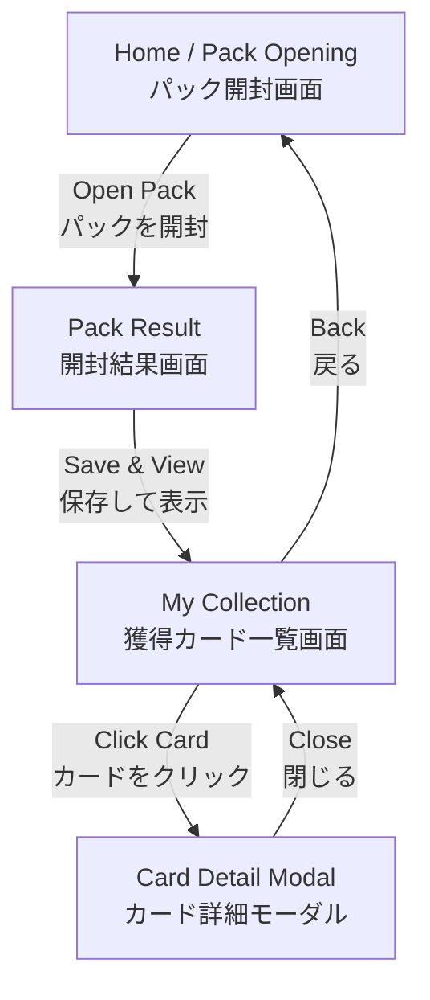

# PokeTutorial - アプリケーション要件定義書

## 1. プロジェクト概要
SpringBootとVue.jsを用いた、初心者向けフルスタックWebアプリケーション開発チュートリアル。
「Pokémon Trading Card Game Pocket」を題材に、パック開封とカード収集の楽しさを体験できる「PokeCa Pocket Lite」を作成します。

## 2. 目的 (Learning Objectives)
このプロジェクトを通じて、以下の技術要素を習得することを目的とします。

### Backend (Spring Boot)
- REST APIの設計と実装
- 外部API (PokeAPI) との連携 (`RestClient` の使用)
- データベース操作 (Spring Data JPA / H2 Database)
- ビジネスロジックの実装 (パック開封のランダムロジック)

### Frontend (Vue.js)
- Vue 3 (Composition API / `<script setup>`) の基礎
- コンポーネント設計と再利用
- 非同期通信 (Axios) とデータバインディング
- CSSによるカードデザインとアニメーション

## 3. 機能要件 (Functional Requirements)

### フェーズ1: MVP (Minimum Viable Product)

#### 1. パック開封機能 (Gacha)
- ユーザーは「パックを開封する」ボタンを押すことができる。
- バックエンドはPokeAPIからランダムなポケモンデータを取得し、5枚のカードとして返却する。
- フロントエンドはカードの開封演出を表示する。
- 獲得したカードは自動的にユーザーのコレクションに保存される。

#### 2. マイコレクション機能 (My Collection)
- ユーザーは獲得したカード一覧を閲覧できる。
- カードには画像、名前、タイプ、HPなどの情報が表示される。

#### 3. カード詳細表示
- コレクション内のカードをクリックすると、詳細情報（技、フレーバーテキストなど）が表示される。

### フェーズ2: 追加機能 (Optional)
- **デッキ構築**: 獲得したカードでデッキを組む（簡易版）。
- **ユーザー認証**: ログイン機能（Spring Security）。
- **トレード機能**: 他のユーザーとカードを交換。

## 4. 技術スタック (Tech Stack)

| カテゴリ | 技術要素 | 選定理由 |
| --- | --- | --- |
| **Backend** | Java 21 | 最新のLTSバージョン |
| | Spring Boot 3.3.x | 最新の標準フレームワーク |
| | Spring Web | REST API構築 |
| | Spring Data JPA | データベースアクセス |
| | H2 Database | セットアップ不要のインメモリDB (学習用に最適) |
| **Frontend** | Vue.js 3 | プログレッシブフレームワーク (Composition API) |
| | Vite | 高速なビルドツール |
| | Axios | HTTPクライアント |
| | Vanilla CSS | 基礎理解のためCSSフレームワークなしで実装 |
| **External** | PokeAPI | ポケモンデータの取得 (認証不要・無料) |

## 5. データモデル (簡易)

### Card (Entity)
- `id`: Long (Primary Key)
- `pokemonId`: Integer (PokeAPIのID)
- `name`: String
- `imageUrl`: String
- `type`: String
- `rarity`: String (APIデータから独自に計算、またはランダム)
- `obtainedAt`: LocalDateTime

## 6. 画面遷移図 (Sitemap)
## 画面遷移図

1. **Home / Pack Opening**: パック開封画面
2. **Collection**: 獲得カード一覧画面
3. **Card Detail**: カード詳細モーダル

---
この要件定義に基づき、実装を進めていきます。
